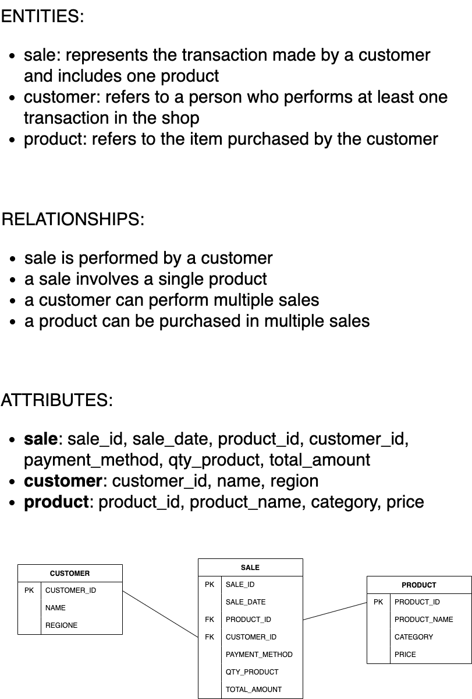
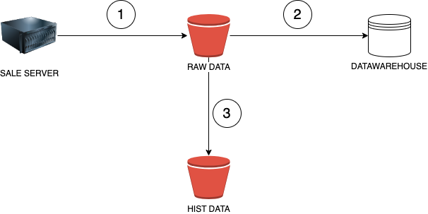

# sales_etl
This is an exercises provided by ChatGPT about sales data.

## Scenario
You are working for a retail company that wants to analyze sales performance. The business goal is to track and understand sales trends across different dimensions like time, products, and regions. Your task is to create a star schema to support this analysis and implement the ETL pipeline using Apache Airflow.

## Tasks
1. Gather Business Requirements
    - Understand the key questions the business wants to answer. For example:
    - What are the total sales by product category each month?
    - Which region has the highest sales in a given quarter?
    - What is the trend of sales for a specific product over time?

2. Conceptual Model

Define the high-level entities and their relationships.

3. Logical Model

Detail the specific attributes of each entity, including keys and relationships.

4. Physical Model

Translate the logical model into a database schema with tables, columns, and data types.
ETL Pipeline

5. Create an Airflow DAG to:

- Extract sales, product, and region data from source systems.
- Transform the data to match the star schema structure.
- Load the data into a data warehouse.


## Data
Below there's a data sample:
```json
[
    {
        "sales_id": 1234,
        "product_id": 1,
        "product_name": "Laptop",
        "category": "Electronics",
        "price": 1200.0,
        "quantity": 2,
        "total_amount": 2400.0,
        "customer_id": 3,
        "customer_name": "Charlie",
        "region": "East",
        "payment_method": "Credit Card",
        "sale_date": "2024-12-30 15:20:30"
    },
    {
        "sales_id": 5678,
        "product_id": 2,
        "product_name": "Smartphone",
        "category": "Electronics",
        "price": 800.0,
        "quantity": 1,
        "total_amount": 800.0,
        "customer_id": 1,
        "customer_name": "Alice",
        "region": "North",
        "payment_method": "PayPal",
        "sale_date": "2024-12-30 15:21:10"
    }
]
```

## Conceptual Model


## Logical Model


## Physical Model


## Architecture - Data Flow
Since the data is retrieved by a server (pull ingestion) these are the steps to achieve:
1. read data from the API
2. store raw data into a bucket
3. read raw data from bucket and load to datawarehouse
4. move raw data to hist




## Architecture - Extract Load


### Bigquery

```sql
create table ace-mile-446412-j2.SALES.RAW_SALES(
  category string,
  customer_id string,	
  customer_name string,
  payment_method string,	
  price string,	
  product_id	string,
  product_name	string,
  quantity	string,
  region	string,
  sale_date	string,
  sales_id	string,
  total_amount string
);

CREATE TABLE ace-mile-446412-j2.SALES.DIM_PRODUCT (
    product_id STRING,
    product_name STRING,
    category STRING
);

CREATE TABLE ace-mile-446412-j2.SALES.DIM_CUSTOMER (
    customer_id STRING,
    customer_name STRING,
    region STRING
);

CREATE TABLE ace-mile-446412-j2.SALES.FCT_SALES (
    sales_id STRING,
    sale_date DATE,
    customer_id STRING,
    product_id STRING,
    payment_method STRING,
    quantity INT64,
    price FLOAT64,
    total_amount FLOAT64
);


```

